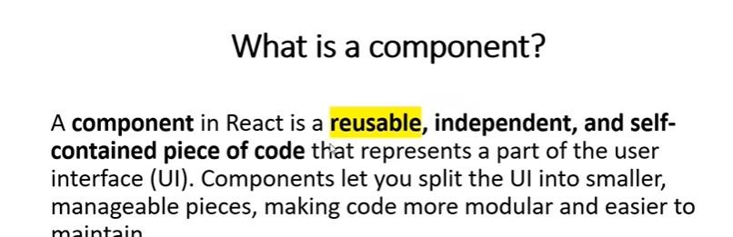

## ! what is react Component?

## what is Virtual DOM?

virtual DOM is lightWeight copy of Actual Dom.
it is a javaScript Representation of the UI that React Mantains in memory.

When Changes occur in react Application,React First updates virtual DOM instead of the Actual DOM.
